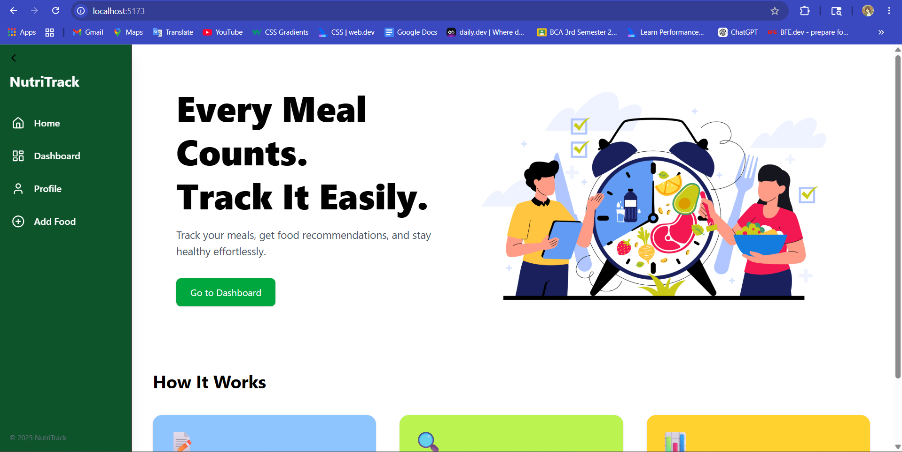
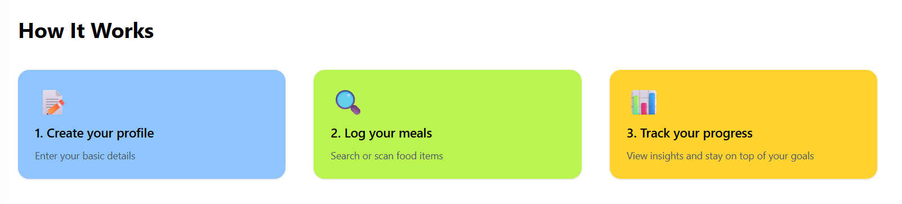
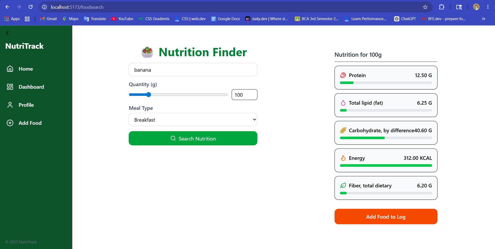
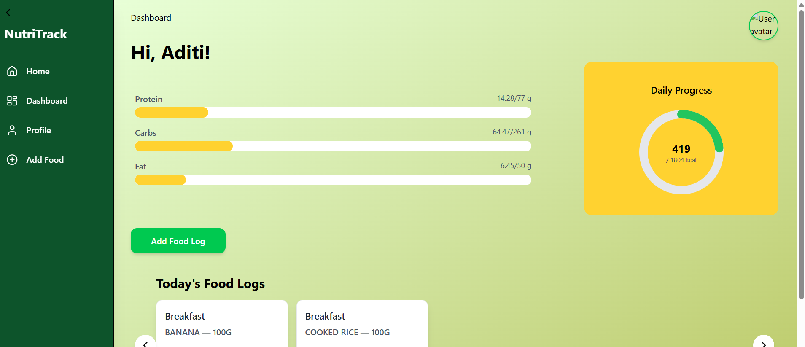
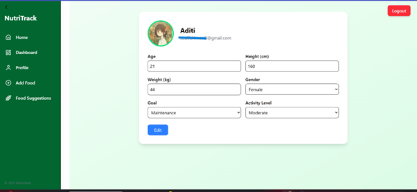
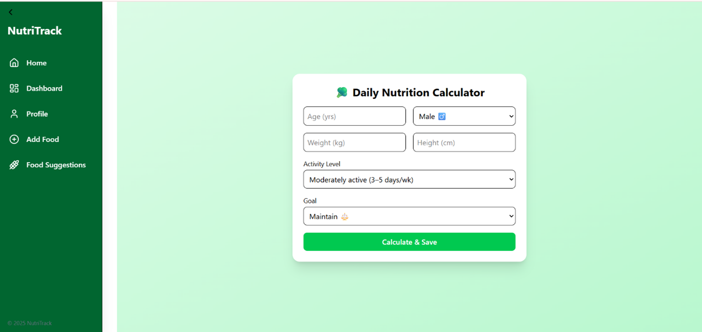

A nutrition tracking web application that helps users monitor their daily dietary intake and achieve their health goals through personalized nutrition analysis.

FEATURES  
* Log daily food intake
* Real-time nutrition dashboard
* Calculates personalized dietary requirements
* Fetches food nutrition data using USDA Food Database API
* Tracks:
-Calories
-Protein
-Carbohydrates
-Fats
-Fiber
* Compares consumed nutrients against daily requirements
* Daily nutrition progress monitoring
* Personalized dietary requirement calculations using:
-Age
-Height
-Weight
-Gender
-Activity level

TECH STACK  
Frontend: React.js, Tailwind CSS  
Backend: Express  
Database: MongoDB  
Authentication: Firebase Authentication  
APIs: USDA FoodData Central API for nutrition information 

HOW IT WORKS 

1. Enters personal details:
-Age
-Height
-Weight
Activity level
2. NutriTrack calculates daily dietary requirements
3. User logs consumed foods
4. The application fetches nutritional information from the USDA database
5. Nutrition values are extracted and processed
6. Dashboard updates dynamically to display:
-Total calories consumed
-Macronutrient intake
-Remaining nutritional goals
-Daily progress

###SCREENSHOTS 
###Homepage 
 
 

## Add Food Logs

##Dashboard Page

##Profile Page 
 

##Calculate Nutrition Requirement
  

